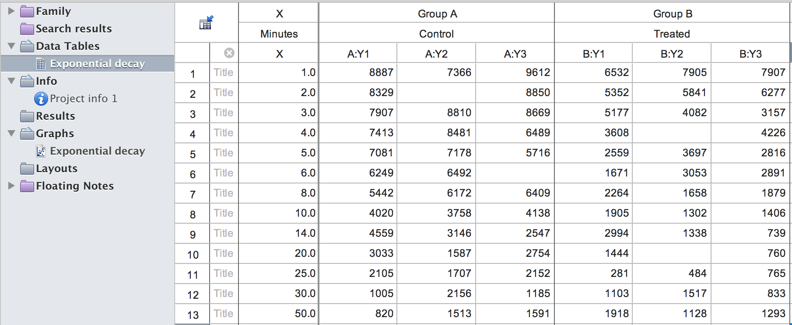

```{r setup, include = FALSE}
knitr::opts_chunk$set(
  collapse = TRUE,
  comment = "#>"
)
```

# Background
Prism GraphPad is a software application for scientific graphing, curve fitting and statistical testing. It has been popular among scientists, especially experimental biologists. The `pzfx` R package provides an easy way to read data tables that are in Prism GraphPad format (`.pzfx` files) into R. Since Prism5 (the current version as of mid 2018 is Prism7), Prism stores its data tables in `XML` format and is possible to be parsed into `data.frame`s in R. The `pzfx` package contains functions to list and load Prism tables into R, through parsing the `XML` by the package `xml2`.

# Main functionality
There are only two main functions in the package. `pzfx_tables` lists the tables in a `.pzfx` file. `read_pzfx` reads one table into R from a `.pzfx` file.

We use a Prism example file `exponential_decay.pzfx` to show how these two functions work. Here is the screen shot of this file when opened in Prism. {width=100%}

List tables from a `.pzfx` file:

```{r}
library(pzfx)
pzfx_tables(system.file("extdata/exponential_decay.pzfx", package="pzfx"))
```

Read one specific table into R by table name:

```{r}
df <- read_pzfx(system.file("extdata/exponential_decay.pzfx", package="pzfx"), table="Exponential decay")
head(df)
```

Read one specific table into R by table index (1-based):

```{r}
df <- read_pzfx(system.file("extdata/exponential_decay.pzfx", package="pzfx"), table=1)
head(df)
```

# Additional notes
- Prism allows subcolumns. To accommodate this, `read_pzfx` automatically adds `_1`, `_2` etc to the original column name to account for sub columns if they represent replicates. It tries to infer the subcolumn types and adds appropriate suffix accordingly. For example, trailing `_MEAN`, `_SD`, `_N` are added if subcolumns represent mean, standard deviation and number of observations.

- Prism does not require columns in a table to be of the same length. To accommodate this, `NA`s are added if the columns are of different lengths.

- Prism allows user to exclude data by striking them out individual observations. To accommodate this, an option `strike_action` is available in `read_pzfx`. One can choose to delete these values with `strike_action="exclude"`, keep them with `"keep"`, or convert them to a trailing "*" (as they appear in Prism) with `"star"`. Note if `strike_action="star"` the entire table is converted to type `character`. 

- Prism allows special formating of column names such as superscripts. When reading into R, column names with special formating are converted to regular strings.

```{r, include=FALSE, eval=FALSE}
# generates a hex sticker
library(hexSticker)
sticker(
  expression({
    plot(c(0, 1), c(0, sin(pi / 3)), type="n", axes=F, xlab="", ylab="")
    segments(x0=0, y0=0, x1=0.5, y1=sin(pi / 3), col="white", lwd=3)
    segments(x0=1, y0=0, x1=0.5, y1=sin(pi / 3), col="white", lwd=3)
    segments(x0=0, y0=0, x1=1, y1=0, col="white", lwd=3)
    segments(x0=0, y0=0, x1=0.5, y1=0.5 * tan(pi / 6), col="white", lwd=3)
    segments(x0=0.5, y0=sin(pi / 3), x1=0.5, y1=0.5 * tan(pi / 6), col="white", lwd=3)
    segments(x0=0.5, y0=0.5 * tan(pi / 6), x1=1, y1=0, col="white", lwd=3)
  }),
  package="pzfx",
  p_size=8,
  p_y=1.6,
  s_x=0.75,
  s_y=0.7,
  s_width=1.7,
  s_height=1.7,
  h_fill="#ff692b",
  h_color="#ff4a00",
  url="https://yue-jiang.github.io/pzfx/",
  u_color="white",
  filename="man/figures/logo.png")
```
